# Procesamiento de Imágenes - Trabajo Práctico 4
Integrantes:
- Francisco Devaux
- Agustín Yornet de Rosas

## Introducción
Este trabajo corresponde al Trabajo Práctico 4 de Procesamiento de Imágenes, y consiste en los siguientes documentos:

- Informe hecho en Markdown (informe.md) con detalles sobre la resolución de los ejercicios.
- [Notebook interactivo de Python (PDI_TP4.ipynb)](PDI_TP4.ipynb) con la resolución de los ejercicios y su código fuente. Este puede ejecutarse localmente, celda por celda.
- Carpeta `imágenes/` con las imágenes utilizadas para la resolución de este Trabajo Práctico.


## Ejercicio 1
> Transformada de Fourier (FT) en 2D: Realiza la transformada de Fourier de una imagen en escala de grises utilizando la función fft2 de NumPy. Muestra la imagen original y su transformada de Fourier (usando imshow de Matplotlib).

### Código Fuente

```python
f = np.fft.fft2(img_gray)
fshift = np.fft.fftshift(f)
magnitude_spectrum = np.log(np.abs(fshift) + 1)
```
### Resultados

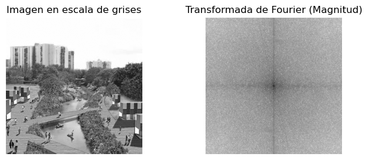

## Ejercicio 11

> Transformada de Fourier inversa: Realiza la transformada de Fourier inversa para recuperar la imagen original a partir de su versión filtrada en el dominio frecuencial. Compara la imagen original con la imagen recuperada.

### Código Fuente

```python
img_recuperada = np.fft.ifft2(f)
img_recuperada = np.real(img_recuperada)
```
### Resultados
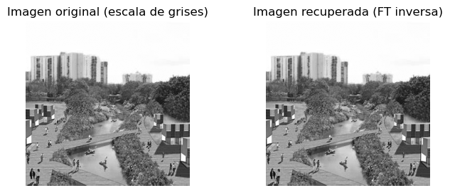
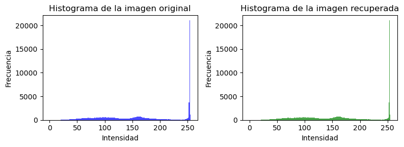

## Inciso a)
> ¿Cómo se visualiza la diferencia entre las frecuencias altas y bajas en una imagen? Ejercicio sugerido: Aplicar la Transformada de Fourier (DFT) y mostrar la magnitud del espectro centrado con fftshift.
### Código Fuente

```python
fshift = np.fft.fftshift(np.fft.fft2(img_gray))
magnitude_spectrum = np.log(np.abs(fshift) + 1)
```
### Resultados
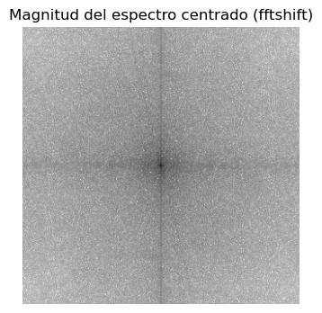

### Análisis
La parte central del espectro generalmente permite visualizar las frecuencias bajas, que varían lentamente y que representan cambios graduales, mientras que las frecuentcias altas se distribuyen alrededor del centro, y representan cambios más bruscos que varían con mayor rapidez.

## Inciso b)
>  ¿Qué ocurre si eliminamos las componentes de alta frecuencia de una imagen? ¿Y si eliminamos las de baja frecuencia? Ejercicio sugerido: Aplicar filtros pasa bajos y pasa altos en el dominio de la frecuencia y reconstruir la imagen con la transformada inversa.
### Código Fuente
```python
rows, cols = img_gray.shape
crow, ccol = rows // 2, cols // 2
radio = 25  # Valor ajustable para el radio del filtro

mask_lp = np.zeros((rows, cols), np.uint8)
mask_lp[crow-radio:crow+radio, ccol-radio:ccol+radio] = 1
fshift_lp = fshift * mask_lp
img_lp = np.fft.ifft2(np.fft.ifftshift(fshift_lp))
img_lp = np.real(img_lp)

mask_hp = np.ones((rows, cols), np.uint8)
mask_hp[crow-radio:crow+radio, ccol-radio:ccol+radio] = 0
fshift_hp = fshift * mask_hp
img_hp = np.fft.ifft2(np.fft.ifftshift(fshift_hp))
img_hp = np.real(img_hp)
```
### Resultados
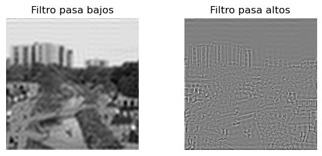

### Análisis
El flitro pasa bajos preserva las frecuencias bajas, atenuando las altas, y da como resultado un suavizado de la imagen. Por otro lado, el filtro pasa altos preserva las frecuencias altas, atenuando las bajas, y da como resultado un agudizamiento de la imagen, remarcando sobre todo los bordes al dejar los cambios bruscos que se producen.

## Inciso c)
> ¿Qué representa la fase de la transformada de Fourier de una imagen? ¿Qué ocurre si se conserva solo la fase o solo la magnitud? Ejercicio sugerido: Reconstruir una imagen usando solo la magnitud y fase de otra imagen, intercambiar fase y magnitud entre dos imágenes distintas.

### Prueba 1: Reconstruir sólo con la magnitud
```python
mag = np.abs(f)
fase_cero = np.zeros_like(f)
f_solo_magnitud = mag * np.exp(1j * fase_cero)
img_solo_magnitud = np.fft.ifft2(f_solo_magnitud)
img_solo_magnitud = np.real(img_solo_magnitud)
```
#### Resultado
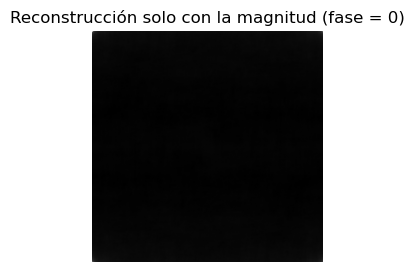

#### Análisis
Al usar sólamente la magnitud, se obtiene una imagen completamente borrosa, oscura, sin detalle alguno, ya que la fase da información sobre la estructura de los objetos y su ubicación, y sin ella se pierden ambas.
### Prueba 2: Reconstruir sólo con la fase
```python
fase = np.angle(f)
mag_uno = np.ones_like(f)
f_solo_fase = mag_uno * np.exp(1j * fase)
img_solo_fase = np.fft.ifft2(f_solo_fase)
img_solo_fase = np.real(img_solo_fase)
```
#### Resultado
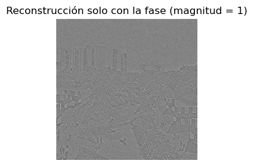

#### Análisis
Reconstruir la imagen con la fase permite reconocer en cierta medida los objetos y la información estructural se mantiene, pero sin la magnitud, se pierde el contraste entre los objetos porque no se representan correctamente las intensidades de las frecuencias.

### Prueba 3: Intercambiar fase y magnitud entre dos imágenes
```python
f2 = np.fft.fft2(img2_gray)
mag2 = np.abs(f2)
fase2 = np.angle(f2)

f_mag1_fase2 = mag * np.exp(1j * fase2)
f_mag2_fase1 = mag2 * np.exp(1j * fase)

img_mag1_fase2 = np.real(np.fft.ifft2(f_mag1_fase2))
img_mag2_fase1 = np.real(np.fft.ifft2(f_mag2_fase1))
```
#### Resultado
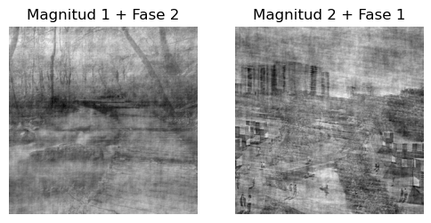

## Inciso d)
>  ¿Por qué se centra la transformada de Fourier para su visualización? ¿Qué efecto tiene? Ejercicio sugerido: Mostrar el espectro de magnitud con y sin aplicar fftshift.

### Código Fuente
```python
f_img = np.fft.fft2(img_gray)
magnitude_no_shift = np.log(np.abs(f_img) + 1)
magnitude_shift = np.log(np.abs(np.fft.fftshift(f_img)) + 1)
```
### Resultados
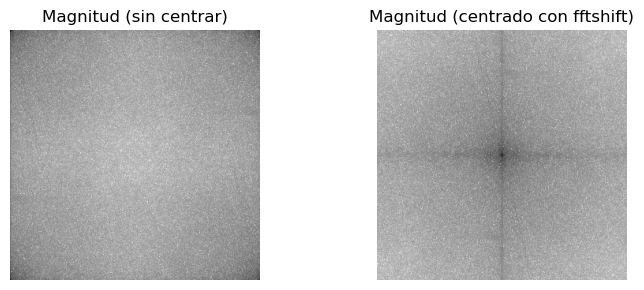

### Análisis
El espectro de magnitud se centra para poder concentrar las frecuencias bajas en una sola posición y diferenciarlas de las altas. De esta forma también es más sencillo aplicar filtros de paso alto o paso bajo. 

## Inciso e)
>  ¿Cómo se comporta la transformada de Fourier ante la traslación o rotación de una imagen? Ejercicio sugerido: Aplicar una traslación o rotación y comparar los espectros de magnitud y fase antes y después.

### Rotación

#### Código Fuente
```python
from scipy.ndimage import rotate

img_gray_rotada = rotate(img_gray, angle=45, reshape=False)

f_rotada = np.fft.fft2(img_gray_rotada)
magnitude_rotada = np.log(np.abs(np.fft.fftshift(f_rotada)) + 1)
fase_rotada = np.angle(f_rotada)

magnitude_original = np.log(np.abs(np.fft.fftshift(f)) + 1)
fase_original = np.angle(f)
```
#### Resultados
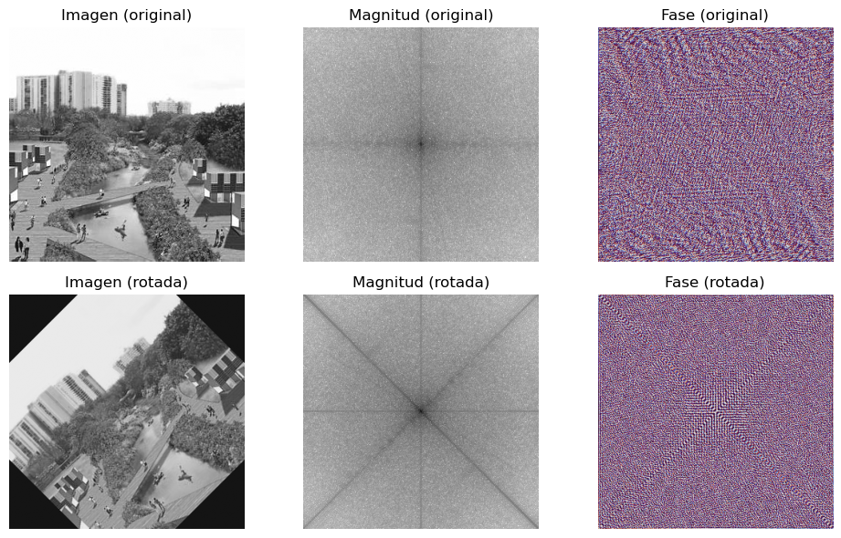

#### Análisis
En este caso, la magnitud no cambia significativamente, pero aparecen líneas negras debido a que la rotación de la imagen produce zonas oscuras, indicando otra información sobre las frecuencias de la imagen. La fase, por otro lado cambia porque la ubicación y las propiedades de los objetos cambian. 

### Traslación
#### Código Fuente
```python
from scipy.ndimage import shift

img_gray_trasladada = shift(img_gray, shift=(20, 30), mode='wrap')

f_trasladada = np.fft.fft2(img_gray_trasladada)
magnitude_trasladada = np.log(np.abs(np.fft.fftshift(f_trasladada)) + 1)
fase_trasladada = np.angle(f_trasladada)
```
#### Resultados
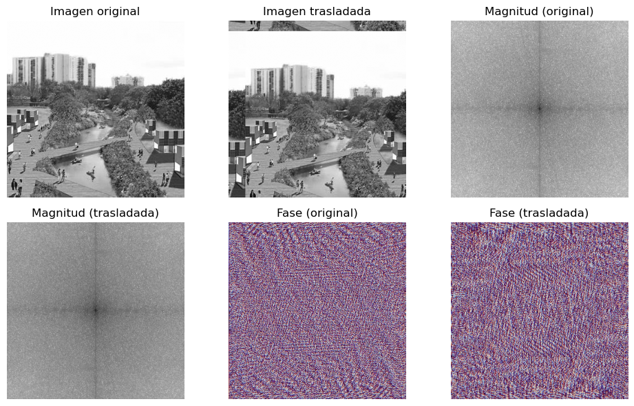

#### Análisis
Como es posible ver, la magnitud no se ve afectada por la traslación porque las intensidades de las frecuencias no varían, pero sí la fase, que es la que contiene información sobre la ubicación de los objetos en la imagen.

## Inciso f)
> ¿Cómo se refleja una estructura periódica en el dominio frecuencial? Ejercicio sugerido: Usar imágenes sintéticas (rejillas, líneas) y observar cómo se representan sus frecuencias dominantes.

### Código Fuente
```python
img_pat = imread('imagenes/vector-line-seamless-pattern.jpg')

f_pat = np.fft.fft2(img_pat_gray)
fshift_pat = np.fft.fftshift(f_pat)
magnitude_pat = np.log(np.abs(fshift_pat) + 1)
fase_pat = np.angle(fshift_pat)
```
### Resultados
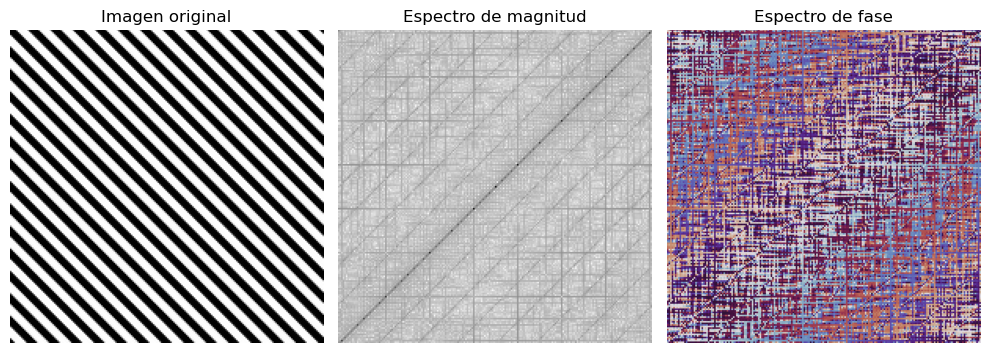

### Análisis
En la imagen original, la rejilla se ve como una serie de líneas que se repiten en el espacio. En el espectro de magnitud y en el espectro de fase se observan patrones regulares que se forman debido a la periodicidad de la rejilla.

## Inciso g)
> ¿Qué diferencias se observan en el espectro de imágenes suaves vs. imágenes con bordes pronunciados? Ejercicio sugerido: Comparar el espectro de una imagen desenfocada vs. la original con bordes definidos.

### Código Fuente
```python
img_blur = gaussian_filter(img_gray, sigma=5)
img_edges = np.hypot(sobel(img_gray, axis=0), sobel(img_gray, axis=1))

f_blur = np.fft.fft2(img_blur)
fshift_blur = np.fft.fftshift(f_blur)
magnitude_blur = np.log(np.abs(fshift_blur) + 1)

f_edges = np.fft.fft2(img_edges)
fshift_edges = np.fft.fftshift(f_edges)
magnitude_edges = np.log(np.abs(fshift_edges) + 1)
```
### Resultados
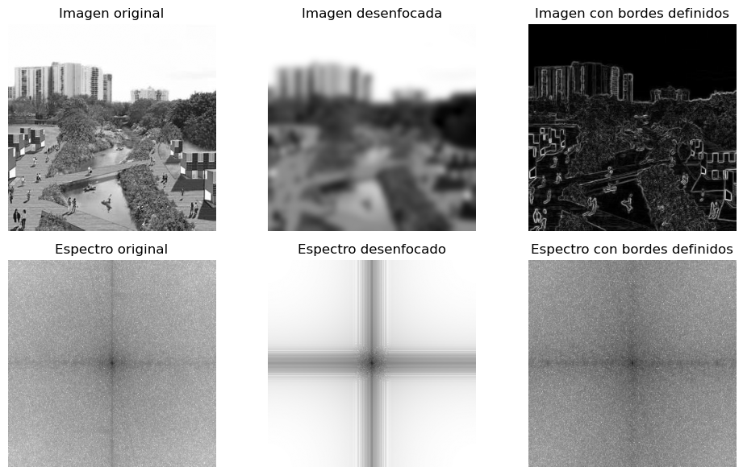

### Análisis
En el espectro de la imagen desenfocada, se observa que las frecuencias altas están atenuadas, lo que indica que la imagen tiene menos detalles y menos bordes definidos, lo que resulta en menores cambios bruscos entre intensidades y la aparición de frecuencias principalmente bajas. En cambio, en el espectro de la imagen con bordes definidos, se observa una mayor presencia de frecuencias altas, lo que indica que la imagen tiene más detalles y bordes pronunciados, resultando en cambios bruscos entre intensidades.

## Inciso h)
> ¿Qué ocurre si aplicamos un filtro de forma circular o rectangular en el espectro? ¿Cómo cambia la imagen? Ejercicio sugerido: Implementar máscaras ideales de paso bajo y paso alto circulares y cuadradas, y observar sus efectos.

### Código Fuente
```python

# APLICACIÓN DE FILTROS CIRCULARES Y CUADRADOS
rows, cols = img_gray.shape
crow, ccol = rows // 2, cols // 2
radio = 40  # radio para máscaras circulares
lado = 80   # lado para máscaras cuadradas

mask_circ_lp = np.zeros((rows, cols), np.uint8)
Y, X = np.ogrid[:rows, :cols]
dist_from_center = np.sqrt((X - ccol)**2 + (Y - crow)**2)
mask_circ_lp[dist_from_center <= radio] = 1

mask_circ_hp = np.ones((rows, cols), np.uint8)
mask_circ_hp[dist_from_center <= radio] = 0

mask_sq_lp = np.zeros((rows, cols), np.uint8)
mask_sq_lp[crow-lado//2:crow+lado//2, ccol-lado//2:ccol+lado//2] = 1

mask_sq_hp = np.ones((rows, cols), np.uint8)
mask_sq_hp[crow-lado//2:crow+lado//2, ccol-lado//2:ccol+lado//2] = 0

fshift = np.fft.fftshift(np.fft.fft2(img_gray))

f_circ_lp = fshift * mask_circ_lp
f_circ_hp = fshift * mask_circ_hp
f_sq_lp = fshift * mask_sq_lp
f_sq_hp = fshift * mask_sq_hp

mag_circ_lp = np.log(np.abs(f_circ_lp) + 1)
mag_circ_hp = np.log(np.abs(f_circ_hp) + 1)
mag_sq_lp = np.log(np.abs(f_sq_lp) + 1)
mag_sq_hp = np.log(np.abs(f_sq_hp) + 1)

# RECONSTRUCCIÓN DE IMÁGENES
img_circ_lp = np.fft.ifft2(np.fft.ifftshift(f_circ_lp))
img_circ_lp = np.real(img_circ_lp)

img_circ_hp = np.fft.ifft2(np.fft.ifftshift(f_circ_hp))
img_circ_hp = np.real(img_circ_hp)

img_sq_lp = np.fft.ifft2(np.fft.ifftshift(f_sq_lp))
img_sq_lp = np.real(img_sq_lp)

img_sq_hp = np.fft.ifft2(np.fft.ifftshift(f_sq_hp))
img_sq_hp = np.real(img_sq_hp)
```

### Resultados
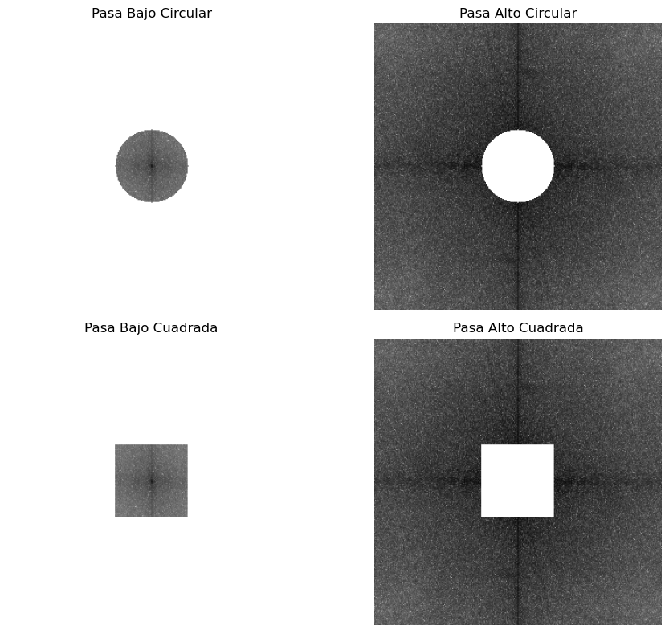
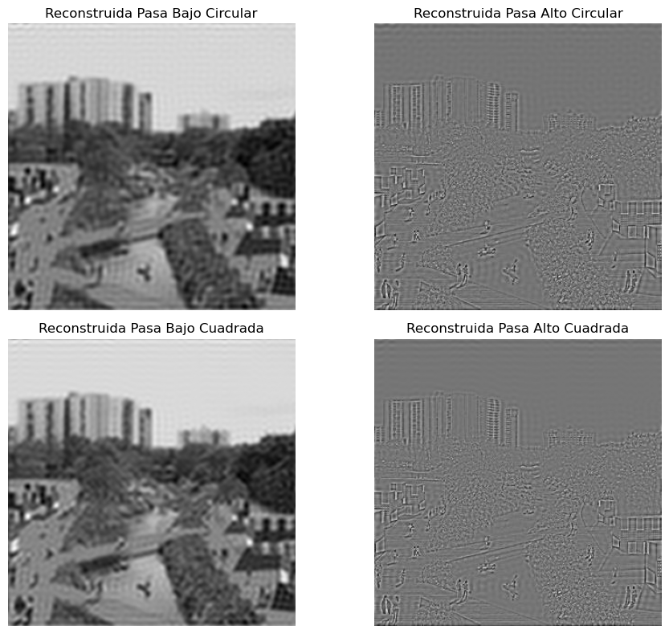

### Análisis
Al aplicar un filtro de paso bajo circular, se eliminan las frecuencias altas y se preservan las bajas, lo que resulta en una imagen suavizada. Por otro lado, al aplicar un filtro de paso alto circular, se eliminan las frecuencias bajas y se preservan las altas, lo que resulta en una imagen más nítida y con bordes más definidos. Al aplicar un filtro rectangular, el efecto es similar pero con una forma diferente de la máscara, que afecta la forma en que se eliminan las frecuencias.

Para este ejemplo, aplicar una máscara cuadrada y otra circular no resultó en diferencias significativas, pero sí se notó que la máscara cuadrada afecta más frecuencias bajas que la circular porque el área de la máscara cuadrada es mayor que la del círculo, lo que permite alterar mayor cantidad de frecuencias.

## Inciso i)
> ¿Cuál es la relación entre el patrón de una imagen (orientación, repetición) y la simetría del espectro? Ejercicio sugerido: Usar imágenes diagonales o repetitivas y analizar la simetría del espectro.

### Código Fuente
```python
img_geo = imread('imagenes/geometric-bg.jpg')

f_geo = np.fft.fft2(img_geo_gray)
fshift_geo = np.fft.fftshift(f_geo)
magnitude_geo = np.log(np.abs(fshift_geo) + 1)
```
### Resultados
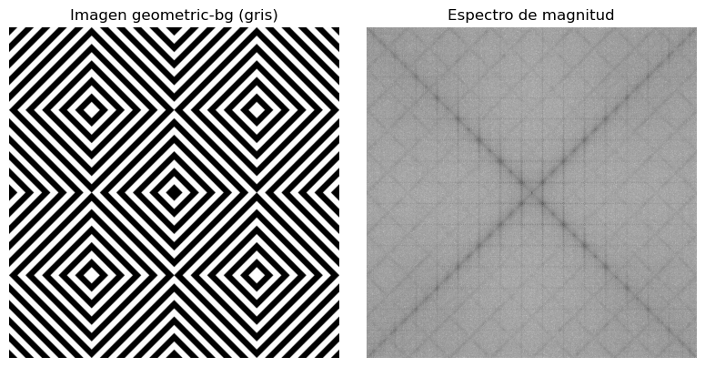

### Análisis
La relación entre el patrón de una imagen y la simetría del espectro es que la simetría del espectro refleja la periodicidad y la orientación de los patrones en la imagen. Por ejemplo, si una imagen tiene un patrón diagonal, el espectro muestra una simetría diagonal, y si la imagen tiene un patrón repetitivo, el espectro muestra picos en las frecuencias correspondientes a esa repetición. 

Imágenes con patrones más complejos, como "paisaje1", tienen espectros igual de complejos y menos simétricos.

## Inciso j)
> ¿Cómo puede usarse el dominio frecuencial para eliminar ruido periódico en una imagen? Ejercicio sugerido: Introducir ruido periódico artificialmente y diseñar un filtro para suprimirlo en el dominio de la frecuencia.

### Código Fuente - Constrcción de ruido periódico
```python
image_path = "imagenes/Lenna.png"
image = Image.open(image_path).convert("RGB")

image_np = np.array(image)

image_with_noise = image_np.copy()
for col in range(0, image_with_noise.shape[1], 20):
    image_with_noise[:, col] = 0

noisy_image = Image.fromarray(image_with_noise)

output_path = "imagenes/Lenna_periodic_noise.png"
noisy_image.save(output_path)
```

### Código Fuente - Estudio del Espectro
```python
img_lenna_ruido = imread('imagenes/Lenna_periodic_noise.png')

if img_lenna_ruido.ndim == 3:
    img_lenna_ruido = np.dot(img_lenna_ruido[..., :3], [0.2989, 0.5870, 0.1140])

f_lenna_ruido = np.fft.fft2(img_lenna_ruido)
fshift_lenna_ruido = np.fft.fftshift(f_lenna_ruido)
magnitude_lenna_ruido = np.log(np.abs(fshift_lenna_ruido) + 1)
```

### Codigo Fuente - Filtro
```python
fshift_filtered = fshift_lenna_ruido.copy()

mask = np.ones_like(fshift_lenna_ruido)
rows, cols = mask.shape
crow, ccol = rows // 2, cols // 2

width = 11  # ancho de la región central a conservar
height = 5  # altura de la región central a conservar
mask[crow-height:crow+height, :] = 0
mask[crow-height:crow+height, ccol-width:ccol+width+1] = 1

fshift_filtered = fshift_lenna_ruido * mask

img_filtered = np.fft.ifft2(np.fft.ifftshift(fshift_filtered))
img_filtered = np.real(img_filtered)
```

### Resultados
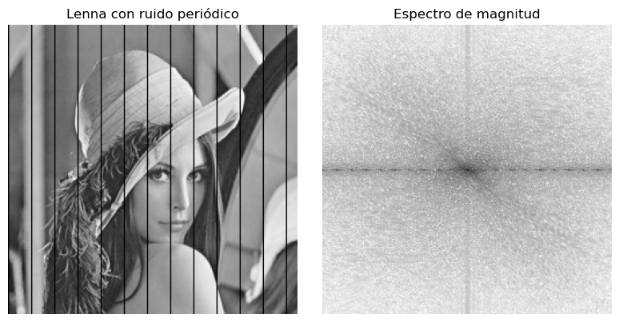
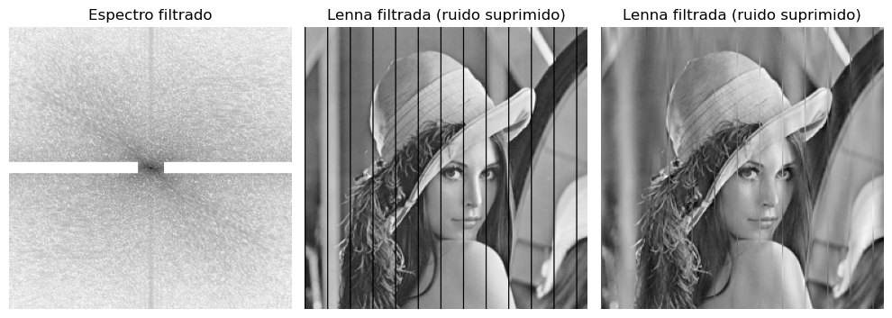

### Análisis
Se puede observar que la imagen original tiene un ruido periódico que se manifiesta como puntos sobre y=0 en el espectro de magnitud. Al eliminarlos, se reduce el ruido de la imagen pero se pierden algunos detalles como contrapartida.

### Extra - Pruebas de distintas máscaras
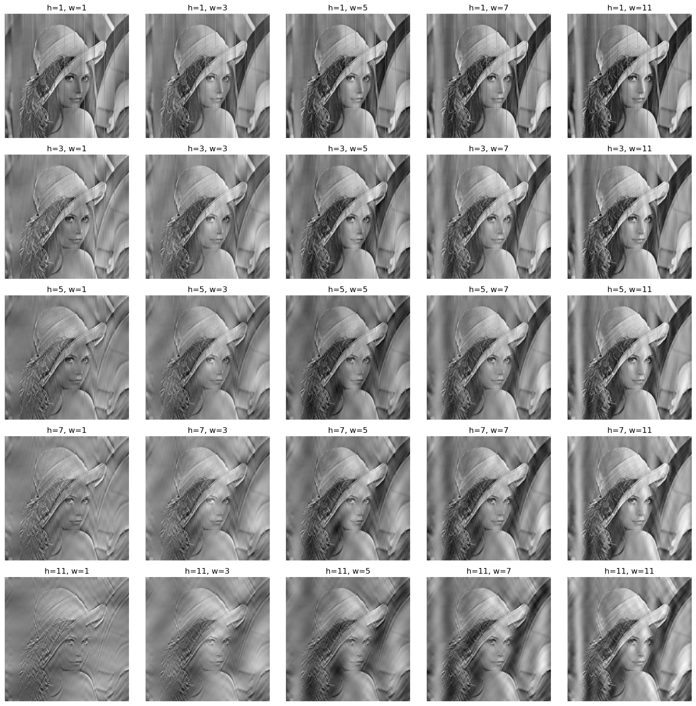