# Trabajo Práctico 6 - Procesamiento de Imágenes

- Francisco Devaux
- Agustín Yornet de Rosas

## Representación y Descripción de Características

### Ejercicio 2

> Representación por relleno de regiones. Identificar los objetos en una imagen binaria y colorear cada región detectada. Sugerencia: scikit-image: measure.label, regionprops, label2rgb.

En este ejercicio, se carga una imagen binaria (`imagenes/bin1.png`). Luego, se utiliza `skimage.measure.label` para etiquetar las regiones conectadas en la imagen. Finalmente, `skimage.color.label2rgb` se usa para colorear cada región detectada, facilitando su visualización. La imagen resultante con las regiones coloreadas se muestra utilizando `matplotlib.pyplot`.

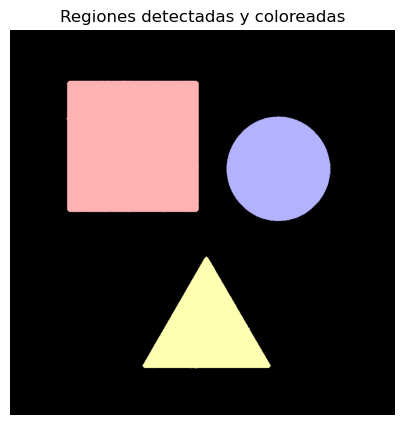

### Ejercicio 4

> Cálculo de propiedades geométricas. Extraer área, perímetro, excentricidad y compacidad de cada región segmentada. Sugerencia: regionprops de skimage.measure.

Utilizando las regiones etiquetadas del ejercicio anterior, este ejercicio extrae propiedades geométricas de cada región mediante `skimage.measure.regionprops`. Las propiedades calculadas son:
*   **Área:** Número de píxeles en la región.
*   **Perímetro:** Longitud del borde de la región.
*   **Excentricidad:** Medida de cuán alargada es la región (0 para un círculo, 1 para una línea).
*   **Compacidad:** Calculada como (perímetro^2) / (4 * pi * área). Un valor cercano a 1 indica una forma compacta similar a un círculo.

Los resultados se almacenan en listas y luego se presentan en una tabla utilizando `pandas.DataFrame`. Adicionalmente, se muestra una figura donde cada región etiquetada tiene superpuestas sus medidas geométricas calculadas.

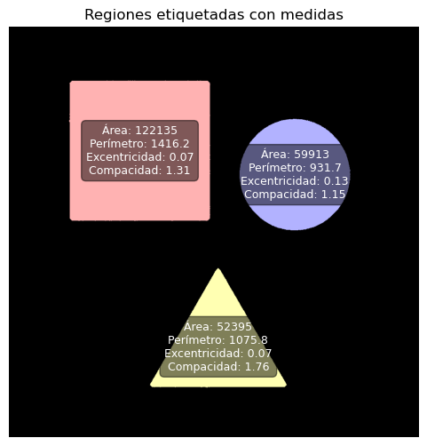

### Ejercicio 6

> Descriptores de textura con GLCM. Calcular contraste, correlación y homogeneidad de regiones usando matrices de co-ocurrencia. skimage.feature.greycomatrix, greycoprops.

Este ejercicio se enfoca en el análisis de textura utilizando la Matriz de Co-ocurrencia de Niveles de Gris (GLCM).
Se carga una imagen (`imagenes/tree.png`), se convierte a escala de grises y luego a formato `uint8`.

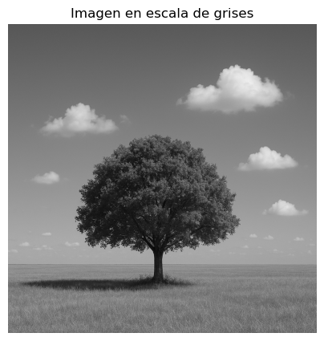

Se calcula la GLCM utilizando `skimage.feature.graycomatrix`, considerando una distancia de 1 píxel y un ángulo de 0 grados (horizontal).
A partir de la GLCM, se calculan tres descriptores de textura:
*   **Contraste:** Mide la variación local de intensidad en la imagen.
    $$
    \text{Contraste} = \sum_{i,j = 0} ^ {niveles - 1} P_{i,j} (i - j)^2
    $$
*   **Correlación:** Mide la dependencia lineal de los niveles de gris de los píxeles vecinos.
    $$
    \text{Correlación} = \sum_{i,j = 0} ^ {niveles - 1} P_{i,j}\left[\frac{(i - \mu_i)(j - \mu_j) }{\sqrt{(\sigma_i^2) (\sigma_j^2)}}\right]
    $$
*   **Homogeneidad:** Mide la similitud de los niveles de gris de los píxeles vecinos.
    $$
    \text{Homogeneidad} = \sum_{i,j = 0} ^ {niveles - 1} \frac{P_{i,j}}{1 + (i - j)^2}
    $$

La imagen en escala de grises se muestra y los valores calculados para contraste, correlación y homogeneidad se imprimen. Se observa un contraste alto (279.4402), lo que sugiere texturas fuertes o bordes. La correlación también es alta (0.9167), indicando una alta dependencia entre intensidades de píxeles vecinos. La homogeneidad es de 0.3069, lo que sugiere que la imagen no es muy uniforme en términos de textura.

### Ejercicio 8

> Relación espacial entre regiones. Determinar si las regiones están adyacentes o si una está contenida en otra. skimage.measure.regionprops + análisis de coordenadas / bounding boxes.

Para este ejercicio, se carga la imagen `imagenes/binboxes.png`, se convierte a escala de grises y se umbraliza para obtener una imagen binaria. Esta imagen binaria se guarda como `imagenes/binboxes_binary.png`.

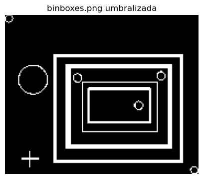

Se etiquetan las regiones conectadas en la imagen binaria. Luego, se define una función `check_adjacency_or_containment` que itera sobre pares de regiones y analiza sus *bounding boxes* (cajas delimitadoras) para determinar relaciones espaciales:
*   **Contención:** Se verifica si el *bounding box* de una región está completamente dentro del *bounding box* de otra.
*   **Adyacencia:** Se verifica si los *bounding boxes* se tocan o superponen en los bordes sin que una contenga a la otra.

Las relaciones encontradas se imprimen. 

```
Región 2 contiene a la región 3
Región 2 contiene a la región 5
Región 2 contiene a la región 6
Región 2 contiene a la región 7
Región 2 contiene a la región 8
Región 2 contiene a la región 9
Región 3 contiene a la región 5
Región 3 contiene a la región 6
Región 3 contiene a la región 7
Región 3 contiene a la región 8
Región 3 contiene a la región 9
Región 6 es adyacente a la región 7
Región 7 contiene a la región 8
Región 7 contiene a la región 9
Región 8 contiene a la región 9
```

Finalmente, se muestra la imagen con las regiones coloreadas y numeradas en su centroide (aproximado al píxel superior del centroide para mejor visualización).

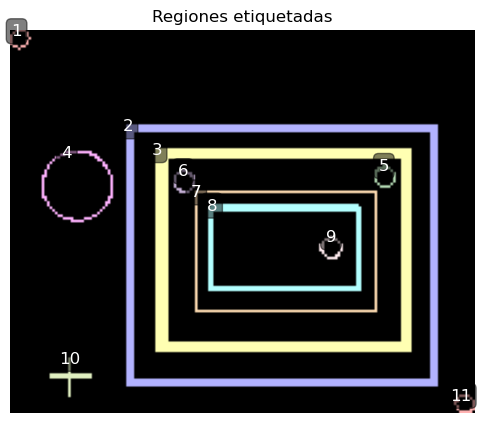

## 2 Reconocimiento de Patrones

### Ejercicio 1

> Template Matching. Buscar una figura conocida dentro de una imagen mediante una plantilla. Sugerencia: cv2.matchTemplate, cv2.minMaxLoc.

En este ejercicio, se realiza la búsqueda de una plantilla dentro de una imagen más grande.
Primero, se carga la imagen principal (`imagenes/sonic_rings.png`) y se extrae una sección de esta imagen para usarla como plantilla (`sonic_section`). Esta sección se guarda como `imagenes/sonic_section.png`.

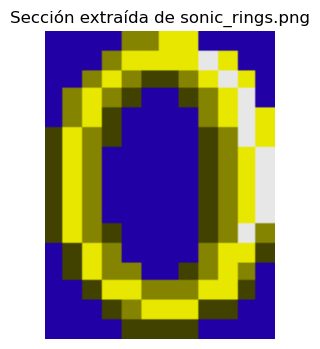

Ambas imágenes (principal y plantilla) se convierten a escala de grises.
Se utiliza `cv2.matchTemplate` con el método `cv2.TM_CCOEFF_NORMED` para encontrar coincidencias de la plantilla en la imagen principal. Este método devuelve un mapa de correlación.
`cv2.minMaxLoc` se usa para encontrar la ubicación de la máxima correlación (la mejor coincidencia).
Se define un umbral para identificar múltiples coincidencias si las hubiera. Se dibujan rectángulos rojos alrededor de las regiones coincidentes en una copia de la imagen original.
La imagen con las coincidencias marcadas se muestra, y se imprime el valor de la máxima coincidencia y la ubicación superior izquierda de la mejor coincidencia.

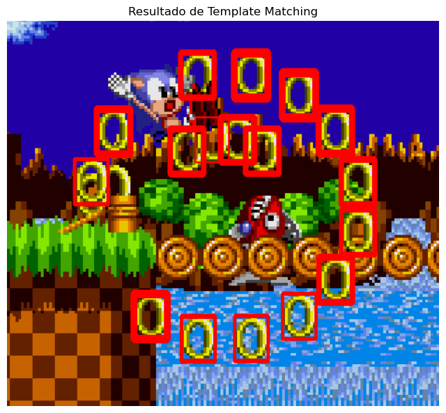

```
Valor de coincidencia máxima: 1.0000
Ubicación superior izquierda: (632, 90)
```

### Ejercicio 2

> Clasificación basada en características. Extraer características simples (como área o textura) de regiones segmentadas y clasificarlas usando KNN. Sugerencia: scikit-learn + descriptores de regionprops.

Este ejercicio implementa una clasificación de objetos (billetes y monedas) en la imagen `imagenes/bills-coins.jpg` utilizando un clasificador K-Nearest Neighbors (KNN).
Los pasos son:
1.  **Carga y preprocesamiento:** La imagen se carga y se convierte a escala de grises y luego a formato `uint8`.
2.  **Segmentación:** Se umbraliza la imagen para binarizarla y se aplican operaciones morfológicas (`remove_small_objects`, `remove_small_holes`) para limpiar la segmentación.
3.  **Etiquetado de regiones:** Se utiliza `skimage.measure.label` para identificar regiones conectadas.
4.  **Extracción de características:** Para cada región, se extraen:
    *   Área
    *   Perímetro
    *   Contraste GLCM (calculado sobre la región recortada de la imagen en escala de grises).
5.  **Creación del conjunto de datos:** Las características se organizan en un `pandas.DataFrame`.
6.  **Etiquetado (Ejemplo):** Se generan etiquetas de clase de forma automática basándose en el área (regiones con área > 70000 se consideran billetes (clase 1), el resto monedas (clase 0)). *Nota: En una aplicación real, este etiquetado sería manual o provendría de un conjunto de datos anotado.*
7.  **División de datos:** El conjunto de datos se divide en conjuntos de entrenamiento y prueba (`train_test_split`).
8.  **Entrenamiento del clasificador KNN:** Se instancia y entrena un `KNeighborsClassifier` con `n_neighbors=3`.
9.  **Predicción y Evaluación:** Se realizan predicciones sobre el conjunto de prueba y se imprime un reporte de clasificación (`classification_report`).
10. **Visualización:** Se muestra la imagen original con las regiones del conjunto de prueba etiquetadas según la predicción del clasificador KNN.

El reporte de clasificación muestra una precisión perfecta, lo cual es esperable dado el método de etiquetado simplificado basado en un umbral de área que probablemente separa bien las dos clases en este conjunto de datos particular.

```
Reporte de clasificación:
               precision    recall  f1-score   support

           0       1.00      1.00      1.00         3
           1       1.00      1.00      1.00         2

    accuracy                           1.00         5
   macro avg       1.00      1.00      1.00         5
weighted avg       1.00      1.00      1.00         5
```

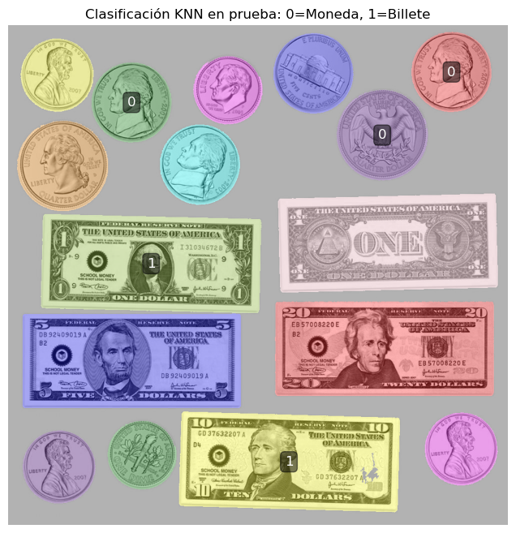

### Ejercicio 5

> Reconocimiento estructural. Representar caracteres como grafos de líneas y nodos. Clasificarlos según su estructura. Sugerencia: Estructuras de grafos con networkx (librería de python).

Este ejercicio tiene como objetivo representar caracteres manuscritos como grafos y clasificarlos según su estructura topológica.
1.  **Carga y Preprocesamiento:** Se carga la imagen `imagenes/handwritten-text.png`, se convierte a escala de grises y se binariza usando el umbral de Otsu. Se aplican operaciones morfológicas de apertura y cierre para limpiar la imagen binaria.

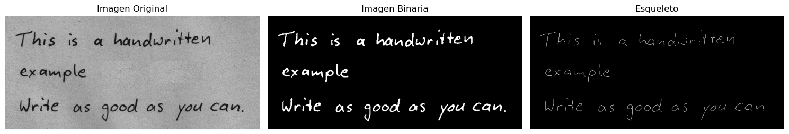


2.  **Esqueletización:** Se aplica `skimage.morphology.skeletonize` a la imagen binaria para obtener el esqueleto de los caracteres.
3.  **Construcción del Grafo:** Se crea un grafo utilizando `networkx.Graph`. Cada píxel blanco del esqueleto se considera un nodo, y se añaden aristas entre nodos 8-conectados.
4.  **Identificación de Nodos Clave:**
    *   **Extremos (Endpoints):** Nodos con grado 1 (conectados a un solo vecino).
    *   **Bifurcaciones (Junctions):** Nodos con grado mayor que 2 (puntos donde las líneas se dividen o unen).
    Estos nodos clave se visualizan sobre la imagen del esqueleto.
    
    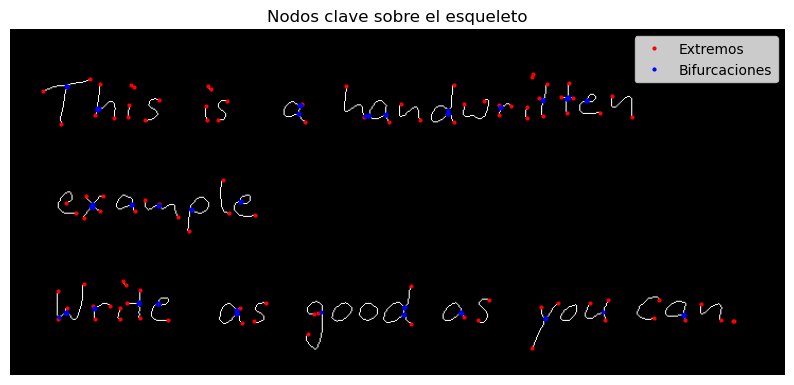

5.  **Clasificación Estructural:**
    *   Se obtienen los componentes conexos del grafo, donde cada componente representa un carácter individual.
    *   Para cada subgrafo (carácter), se define una función `clasificacion_estructural` que lo clasifica en una de las siguientes categorías basándose en el número de extremos y bifurcaciones:
        *   "Línea simple": 2 extremos, 0 bifurcaciones.
        *   "Círculo cerrado": 0 extremos, 0 bifurcaciones.
        *   "Y (bifurcación simple)": 3 extremos, 1 bifurcación.
        *   "Estructura ramificada": Más de 1 bifurcación.
        *   "Otra": Cualquier otra configuración.
    *   Los resultados de la clasificación se muestran en un `pandas.DataFrame`.
6.  **Visualización de la Clasificación:** Se muestra la imagen del esqueleto con las iniciales de la clase estructural superpuestas en el centroide aproximado de cada carácter.

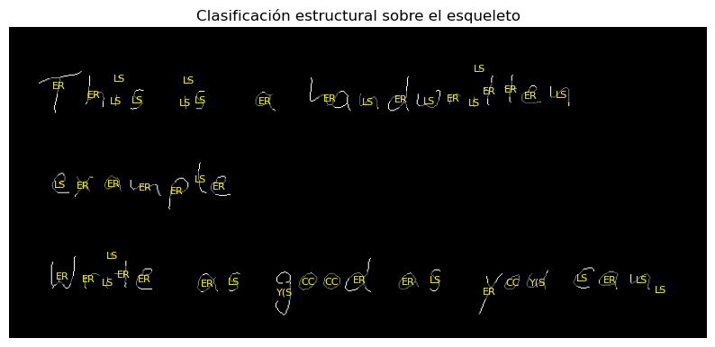

```
Clasificación estructural de caracteres:
      ER: Estructura Ramificada
      LS: Línea Simple
      CC: Círculo Cerrado
      YS: Y (Bifurcación Simple)
      O: Otra
```

### Ejercicio 6

> Clasificación con CNN (Deep Learning). Construir una red neuronal convolucional para clasificar dígitos (MNIST o similar). Sugerencia: TensorFlow o PyTorch + torchvision.datasets.MNIST.

En este ejercicio, se construye y entrena una Red Neuronal Convolucional (CNN) simple para clasificar dígitos manuscritos del conjunto de datos MNIST utilizando PyTorch.
1.  **Carga y Preparación de Datos:**
    *   Se define una transformación para normalizar las imágenes MNIST y convertirlas a tensores.
    *   Se cargan los conjuntos de datos de entrenamiento y prueba de MNIST utilizando `torchvision.datasets.MNIST`.
    *   Se crean `DataLoader` para manejar los datos en lotes durante el entrenamiento y la prueba.
2.  **Definición del Modelo CNN:**
    *   Se define una clase `SimpleCNN` que hereda de `nn.Module`.
    *   La arquitectura incluye:
        *   Dos capas convolucionales (`nn.Conv2d`) con activación ReLU.
        *   Una capa de Max Pooling (`nn.MaxPool2d`).
        *   Una capa de Dropout (`nn.Dropout`) para regularización.
        *   Dos capas completamente conectadas (`nn.Linear`), la última con 10 neuronas para las 10 clases de dígitos.
3.  **Configuración del Entrenamiento:**
    *   Se selecciona el dispositivo (CPU en este caso).
    *   Se instancia el modelo, el optimizador (Adam con tasa de aprendizaje de 0.001) y la función de pérdida (CrossEntropyLoss).
    *   Se limita el número de hilos de PyTorch para evitar posibles problemas en algunos entornos.
4.  **Funciones de Entrenamiento y Prueba:**
    *   `train()`: Itera sobre el `train_loader`, realiza la propagación hacia adelante, calcula la pérdida, realiza la retropropagación y actualiza los pesos del modelo. Imprime el progreso y la pérdida.
    *   `test()`: Evalúa el modelo en el `test_loader`, calcula la pérdida promedio y la precisión.
5.  **Ciclo de Entrenamiento:**
    *   El modelo se entrena durante 2 épocas.
    *   Después de cada época de entrenamiento, se evalúa el modelo en el conjunto de prueba.
    *   Se utiliza `gc.collect()` para la recolección de basura, aunque su impacto es limitado en CPU.

El resultado del entrenamiento muestra una disminución de la pérdida y una alta precisión en el conjunto de prueba (97.99% después de la primera época y 98.23% después de la segunda), lo que indica que la CNN simple aprende a clasificar los dígitos MNIST de manera efectiva.

El output del entrenamiento y prueba es el siguiente:

```
Using device: cpu
Model parameters: 300,426
Starting training...

--- Epoch 1 ---
Epoch 1 [0.0%] Loss: 2.3232
Epoch 1 [10.7%] Loss: 0.9096
Epoch 1 [21.3%] Loss: 0.6733
Epoch 1 [32.0%] Loss: 0.5581
Epoch 1 [42.7%] Loss: 0.4902
Epoch 1 [53.3%] Loss: 0.4464
Epoch 1 [64.0%] Loss: 0.4151
Epoch 1 [74.7%] Loss: 0.3891
Epoch 1 [85.3%] Loss: 0.3685
Epoch 1 [96.0%] Loss: 0.3515
Test set: Average loss: 0.0646, Accuracy: 9799/10000 (97.99%)
Memory usage: N/A (CPU only)


--- Epoch 2 ---
Epoch 2 [0.0%] Loss: 0.1538
Epoch 2 [10.7%] Loss: 0.1809
Epoch 2 [21.3%] Loss: 0.1904
Epoch 2 [32.0%] Loss: 0.1857
Epoch 2 [42.7%] Loss: 0.1817
...
Test set: Average loss: 0.0553, Accuracy: 9823/10000 (98.23%)
Memory usage: N/A (CPU only)

Training completed!
```
